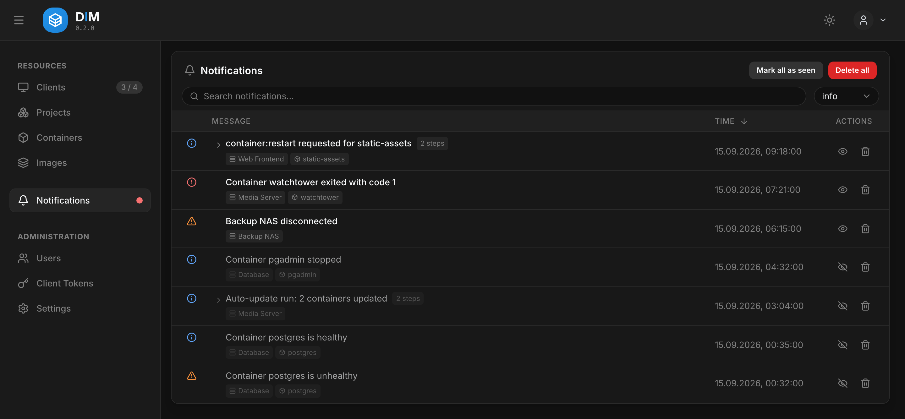

# Activity

The activity list is DIM's record of what happened on each host: containers that stopped,
died, restarted or turned unhealthy, images that were pulled, actions you started and
auto-update runs. It is taken from each host's **Docker event stream**, so it also shows what
happened outside DIM — a `docker compose up` on the host, or a container that crashed at
night.

## Groups

Everything one action or one auto-update run caused is shown as **one row**, with its steps
folded underneath: *container:restart requested* → stopped → started → healthy. The grouping
comes from an id the action carries through the agent, not from matching names or times, so
two actions on the same container never mix.

## Levels and filters

Every entry has a level: **error**, **warning**, **info** or **trace** (routine bookkeeping
such as an agent connecting). The level filter is a minimum — *warning* shows warnings and
errors.

The page opens on what needs a look: **unseen** entries, starting at the highest level any of
them has. Switch the filters to *all* and *info* to see everything. Unseen errors and warnings
raise the red dot next to **Activity** in the sidebar.

**Mark as seen** marks everything the filters and the search leave on screen; the eye icon in
a row marks that group. Seen state is per user.

## Where else it appears

Every detail page — a host, a container, an image, a project — shows the part of the activity
that concerns it, with the same filters.

## Offline hosts

An agent that cannot reach the server keeps its events and hands them over when it reconnects
— up to 500 events, for up to seven days. They appear at the time they happened, not the time
they arrived.

## Retention

**Settings → Activity History**: entries older than 90 days are removed, but the newest 500
are always kept. **Delete all** in the page menu clears the list; single entries cannot be
deleted.
