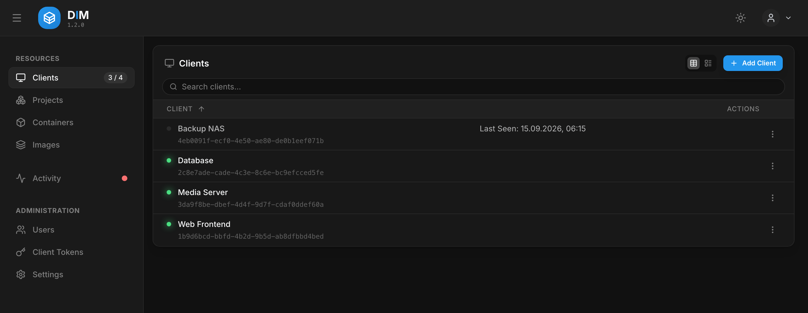
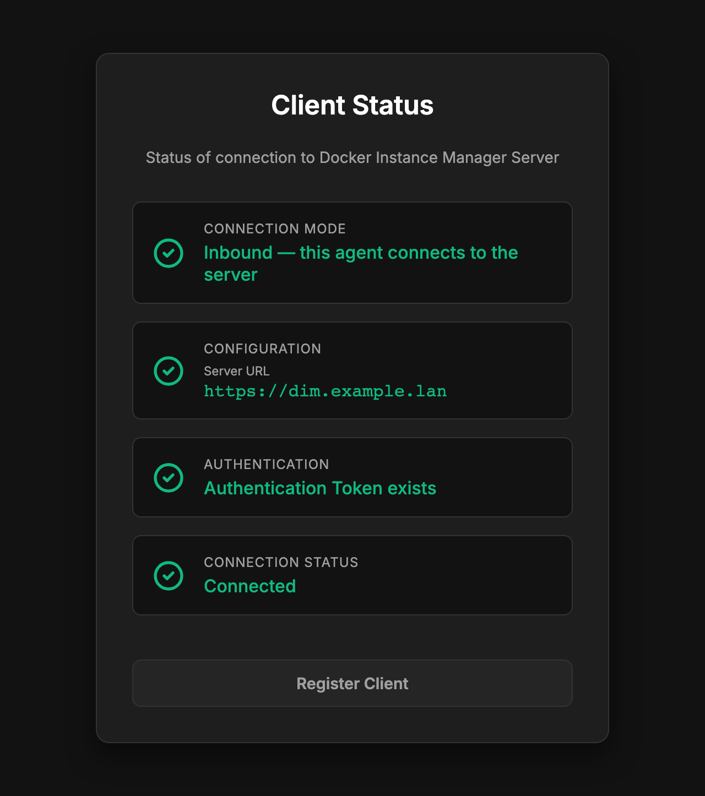

# Clients

A **client** is one Docker host, managed through the DIM agent running on it. This page covers
connecting hosts, editing and removing them. The [Quick Start](../quickstart.md) walks through
the first one.



The dot in front of a client is its **live connection**, not a stored status; the sidebar badge
counts online clients against all of them. A click on a client opens its containers, images,
volumes and networks, each list with its own actions and the host's activity below.

## Which side connects

Server and agent talk over one persistent WebSocket. Either side may open it — you choose when
adding the client, and the modes are named from the server's point of view:

| Mode | Who dials | Use it when | Agent needs |
| :--- | :-------- | :---------- | :---------- |
| **Inbound** | the agent dials the server | the host can reach the server — the usual case | `serverUrl` (set at registration) |
| **Outbound** | the server dials the agent | only the server can reach the host, e.g. a host behind NAT that the server reaches over a VPN | a reachable port (`3001`), no `serverUrl` |

Once connected there is no difference: the same messages flow, the same actions are possible.

## Inbound: the agent connects to the server

1. **Clients → Add Client** → *The agent connects to this server* → **Next**.
2. Optionally give the display name and the **allowed IP or network** the client should start
   with. Without them the agent's hostname names it, and the address it registers from
   becomes its only allowed address.
3. **Generate Token.** The token is shown once and is valid for **30 minutes**; tokens are
   listed under **Client Tokens**.
4. On the agent, open `http://<host>:3001/register` and enter the server URL, the token and
   the **setup PIN** from `docker logs dim-client`.

The agent receives its id and a permanent auth token, stores both in `identity.json` in its
data volume and connects. The register page closes itself.

## Outbound: the server connects to the agent

1. Start the agent with an **empty** `serverUrl`, so it waits to be called.
2. **Clients → Add Client** → *This server connects to the agent* → **Next**.
3. Enter a display name, the **target address** (`host:port`, or `wss://host:port` when the
   agent serves TLS) and the agent's **setup PIN**.
4. **Add Client.** The server dials the agent at once; if the agent refuses, the wizard shows why.

The auth token travels in the connection URL, so an outbound agent outside a network you
control should serve TLS — see [TLS](../security.md#tls).

### Rolling out without reading logs

For agents deployed by automation, where nobody reads the PIN from the log, give the agent a
secret instead and enter that in the wizard:

```yaml
services:
    dim-client:
        environment:
            - DIM_REGISTRATION_SECRET_FILE=/run/secrets/dim_registration
        secrets:
            - dim_registration

secrets:
    dim_registration:
        file: ./dim-registration.secret
```

`DIM_REGISTRATION_SECRET` works too. Remove the secret once the agent is registered; the
agent logs a reminder.

## The setup PIN

Registering an agent decides who controls its host's Docker socket, so both ways of
registering require a PIN from the agent's own log:

- It is printed on every start of an unregistered agent (`docker logs dim-client`) and never
  written to disk. Case and the hyphen do not matter.
- After five wrong attempts it is replaced by a new one, also logged.
- It is dropped with the first successful registration.

## The agent's own pages

The agent serves two small pages on port 3001: `/register` until it is registered, and
`/status`, which shows the connection mode, the server and whether the connection is up.



`enableStatusPage: false` and `enableRegisterPage: false` in the agent's `config.yaml` switch
them off; see [Configuration](../configuration.md#agent-configyaml).

## Editing a client

**Edit** in a client's menu opens the client editor:

- **Display name.**
- **Allowed IP or network** (inbound) — where this client's connections have to come from.
  Widen it to a network (`192.168.1.0/24`) or switch the check off for a host whose address
  changes, such as one on DHCP. The editor warns when the new value would lock out the address
  the agent last connected from.
- **Target address** (outbound) — where the server dials. Saving reconnects at once, so a host
  that moved does not have to be registered again.
- **Auto-update schedule** — give this host a schedule of its own instead of the default; see
  [Updates](updates.md#schedules).

## Removing and re-registering

**Delete** removes the client from DIM: its record and the cached Docker state. Nothing on the
host is touched; the agent keeps running, and its connection is refused from then on.

To register an agent again — after deleting it, or to move it to another server — delete
`identity.json` from its data volume and restart it:

```bash
docker compose exec dim-client rm /app/client/data/identity.json
docker compose restart dim-client
```

It prints a new setup PIN and opens its register page again. A re-registration always creates
a new client entry; delete the old one in the dashboard.

## Updating the agent

The agent runs in a container like any other and is updated the same way: **Pull & Recreate**
on the `dim-client` container, or auto-update via the label. The agent recognises its own
container and hands the recreate to a short-lived helper, so the update does not cut the
branch it sits on.
