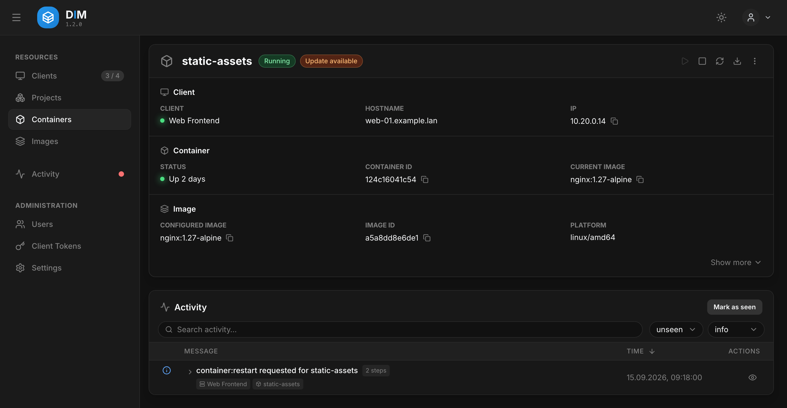
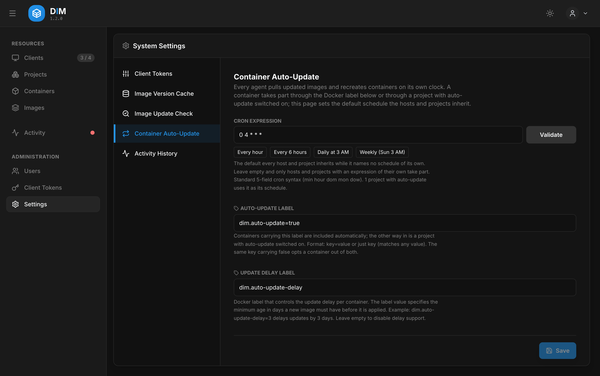
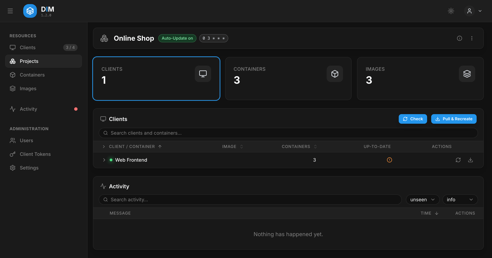

# Updates & Auto-Update

DIM answers two questions for every container: *is its image behind the registry?* and — if you
want it to — *update it, on a schedule, without me.*

## Checking for updates

A check compares the digest of the local image with the one the registry currently serves for
the same tag and platform. It works for **public images** on Docker Hub, `ghcr.io` and
`lscr.io`; the check sends no credentials, so a private repository, or a registry that insists
on a login, shows up as *could not be checked*.

- **By hand:** every list has a **Check** button in its header (everything listed) and in each
  row. Containers, images, projects and a single host all work the same way.
- **On a schedule:** **Settings → Image Update Check** sets an interval; `3600` checks every
  image of every host once an hour. Off by default. A registry that answers with a rate limit
  is paused for as long as it asks, the others carry on.

The **Up-to-date** column then shows ✓ (current), ! (update available) or ? (never checked, or
the registry could not answer). For an image with an update, its page also shows what the
registry says about the new image — version, build date, source.

## Pull & Recreate

**Pull & Recreate** pulls the newer image and recreates the containers that run it, with their
configuration unchanged. It is scoped to where you click it:

| Clicked on | Recreates |
| :--------- | :-------- |
| a container | that container |
| an image (one host, or across hosts) | every container on that image |
| a project | the project's containers only — other containers on the same image are left alone. A dialog asks whether to recreate only those with an update, or all of them (*force*). |



What happened — stop, recreate, start, healthy or not — appears in the activity list as one
group per click; see [Activity](activity.md).

## Auto-update

Auto-update runs **in the agents**, on each host's own clock. The server only tells every agent
what to update when; the agent then checks the registry, pulls and recreates by itself — and
keeps doing so while the server is down. The report arrives once the server is back.

### Which containers take part

A container takes part if **either**

- it carries the auto-update **label** — `dim.auto-update=true` by default, or
- it belongs to a [project](#projects) with auto-update switched on.

The same label key set to `false` (`dim.auto-update=false`) opts a container out of both.

```yaml
services:
    app:
        image: ghcr.io/example/app:2
        labels:
            - dim.auto-update=true
            - dim.auto-update-delay=3      # optional: only images at least 3 days old
```

The **delay** label postpones an update until the new image is a given number of days old — a
simple guard against a broken release. Both label names can be changed under
**Settings → Container Auto-Update**. The **Auto-Update** column in the container lists shows
what enrols each container: *Label*, or the project's name.

### Schedules

Schedules are cron expressions (`0 3 * * *` = daily at 03:00) and are inherited from the top
down. Each agent reads an expression **in its own time zone**, not in the browser's: in a
container that is UTC unless the agent is given `TZ` (see
[Time zones](../configuration.md#time-zones)). The client page shows the zone every agent
reported.

| Level | Set in | Applies to |
| :---- | :----- | :--------- |
| Default | **Settings → Container Auto-Update** | every host and project without a schedule of its own |
| Host | client editor → *own schedule* | the host's labelled containers that are in no project |
| Project | project editor | the project's containers, on every host |



With an empty default only hosts and projects that name a schedule of their own are updated.
A container in a project follows the project's schedule even if its label enrolled it, so a
project's containers are always updated together.

**A run** first pulls every image that is due, and only then recreates the containers — a
project whose third image fails to pull is not left half on the new release. A host that was
off at the scheduled time makes the run up once, a few minutes after it starts. A run that
changed nothing reports nothing.

## Projects

A project groups containers **across hosts** — a web shop's frontend, API and cache, wherever
they run — so they can be checked, pulled and auto-updated together.



Membership is defined by a **query**, not a list: *container name matches `shop-*`*,
*image is `postgres`*, *host is not `test-*`*. Criteria can be combined with AND/OR and are
evaluated top to bottom. The editor shows the matching containers live while you type, and a
container that starts later joins the project by itself.

- A container belongs to **one project at most.** A query that would take containers from
  another project cannot be saved.
- If a container started later matches two projects, it is a **conflict**: it is marked in the
  lists and updated by neither project — with the auto-update label it falls back to the
  host's schedule.
- A project's **schedule** left empty means *use the default*; auto-update itself is switched
  on and off with its own toggle.
- Deleting a project removes the DIM entry only. No container is touched.
