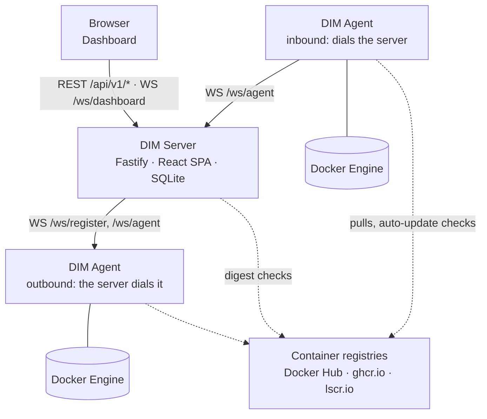

# Docker Instance Manager (DIM)

A single Docker host is easy to look after: `docker ps`, `docker compose pull`, done. Ten of
them are ten SSH sessions, ten places where an image can quietly fall behind its registry,
and no shared answer to "which of my containers are out of date, and what restarted last
night?".

**Docker Instance Manager (DIM) gives those hosts one dashboard.** A lightweight Node.js
agent runs next to the Docker Engine on each host; a central Fastify/React server collects
what the agents report and sends back what you ask them to do. DIM replaces neither Docker
nor Compose — it is the control plane above the engines you already run.

## How the pieces fit together

Three parties are involved:

| | What it holds | Talks to |
|---|---|---|
| **DIM server** | The client list, users, registration tokens, projects, settings, the last Docker state each agent reported, cached registry answers and the activity list — in SQLite | the browser, the agents, container registries |
| **DIM agent** | Its identity, the auto-update policy the server last sent and the activity events not yet acknowledged — in its own data directory | the DIM server, the local Docker Engine, container registries |
| **Docker Engine** | The containers, images, volumes and networks themselves | the agent, over the Docker socket |



The WebSocket between server and agent is one persistent connection, and it does not
matter which side opened it. An **inbound** agent dials the server — the usual case when the
host can reach the server. An **outbound** agent listens on a port of its own and the server
dials it — for hosts the server can reach but that cannot reach the server. Either way the
same messages flow over it; see [Connection Modes](client.md#-connection-modes).

## What happens when you click "Update"

1. The dashboard sends the action to the server, which gives it an `actionId` and forwards
   it to the agent of that host as a `DOCKER_ACTION`.
2. The agent validates it, pulls the image and recreates every container that runs it.
3. Docker's event stream tells the agent what actually happened — a container stopped, was
   recreated, came up healthy or did not. The agent stamps each of those events with the
   `actionId`, so they show up as one group in the activity list.
4. A fresh state snapshot goes to the server and on to every open dashboard. **The frontend
   never polls.**

## Auto-update without the server in the loop

Scheduled updates run **in the agents**, on each host's own clock. The server resolves who
updates when — a default schedule, a per-host schedule, a per-project schedule — and sends
every agent a finished policy. From then on the agent decides on its own: it reads the
labels on its containers, asks the registry itself and recreates what has a newer image.

A server that is down at three in the morning therefore stops no update. It only misses the
report, and the agent hands that over once the server is back — every event carries an id,
so a second delivery changes nothing.

## What it does

- **Centralized management** — containers, images, volumes and networks of every host in
  one dashboard.
- **Container actions** — start, stop, restart, pause, remove and recreate, straight from
  the UI.
- **Image update checks** — local digests compared against Docker Hub, `ghcr.io` and
  `lscr.io`, per tag or per digest.
- **Pull & recreate** — pull a newer image and recreate every affected container in one step.
- **Projects** — group containers across the fleet by a query over hosts, containers and
  images, and give each group its own update schedule.
- **Autonomous auto-update** — label-driven, scheduled per host or per project, with made-up
  runs after downtime and a per-container delay.
- **Activity list** — what happened on each host, from the Docker event stream, grouped by
  the action or the run that caused it.
- **Secure communication** — agents register with a short-lived token and a setup PIN, then
  authenticate with a permanent token; each client is bound to an allowed address.
- **Authentication** — local accounts and OIDC single sign-on.

<div class="grid cards" markdown>

-   :material-rocket-launch: **Install it**

    ---

    Docker Compose for the server and for each agent, the configuration files, and what
    to watch for when upgrading.

    [:octicons-arrow-right-24: Installation & Setup](install.md)

-   :material-sitemap: **Understand it**

    ---

    How the control plane, the dashboard and the agent fit together.

    [:octicons-arrow-right-24: Backend](backend.md) ·
    [:octicons-arrow-right-24: Frontend](frontend.md) ·
    [:octicons-arrow-right-24: Client Agent](client.md)

-   :material-api: **Integrate with it**

    ---

    Every REST endpoint and both WebSocket protocols, request and response shapes
    included.

    [:octicons-arrow-right-24: API Reference](api.md)

-   :material-source-branch: **Contribute to it**

    ---

    Local environment, the Conventional Commits the release is derived from, and the
    build pipeline.

    [:octicons-arrow-right-24: Development Guide](development.md)

</div>

## The repository

The diagram above is the deployment view. In the source tree, DIM is an npm monorepo with
four workspaces:

| Workspace | What it is |
|---|---|
| [`server/backend`](backend.md) | Fastify API server — the control plane and the WebSocket hub, holding the SQLite database. |
| [`server/frontend`](frontend.md) | React SPA (Vite, Tailwind, Zustand), served by the backend from `server/dist/public`. |
| [`client`](client.md) | Lightweight Node.js daemon wrapping Dockerode. It streams state snapshots and Docker events, executes actions and runs the host's auto-update. |
| `shared` | Single source of truth for the TypeScript types, Zod schemas and constants the other three agree on. |

The central piece on the server side is the `ProxyService`: it owns the live agent
connections, persists each state snapshot and fans updates out to every connected
dashboard.

## Getting started in one minute

```bash
# Server
docker run -d --name dim-server -p 3000:3000 \
    -v ./server-data:/app/server/backend/data \
    -v ./server-config.yaml:/app/server/config.yaml \
    ghcr.io/stefgo/dim-server:latest
```

Then open <http://localhost:3000> and log in with `admin` / `admin` — and change that
password right away. **Add Client** in the dashboard walks you through connecting the first
host. The full Compose files for server and agent are in
[Installation & Setup](install.md).
