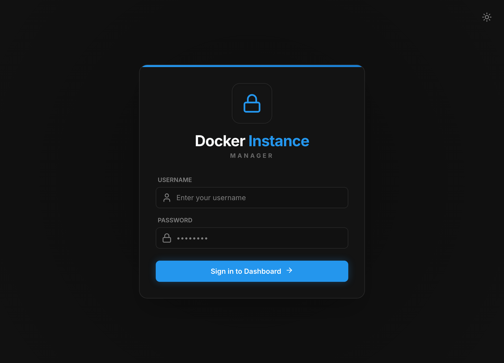
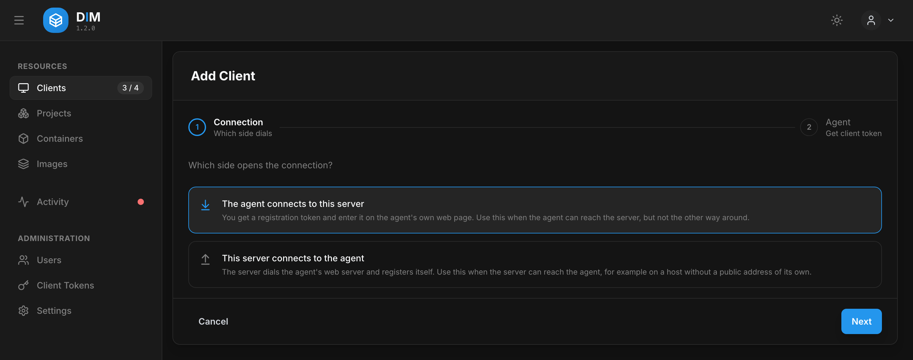
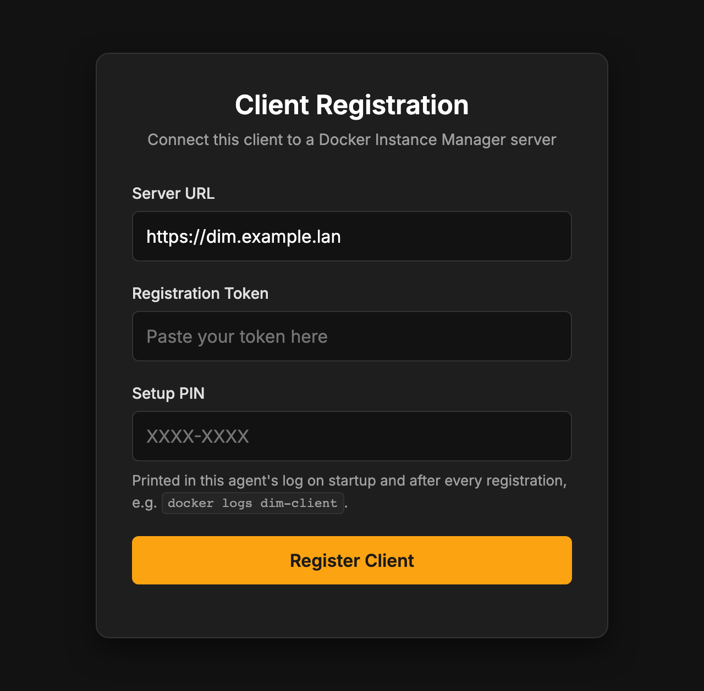

# Quick Start

From nothing to a first managed host in four steps: start the server, sign in, start an agent
on a Docker host, register it. It takes about ten minutes and needs nothing but Docker.

You need:

- **Docker** with the Compose plugin on the machine that runs the server and on every host you
  want to manage (`linux/amd64` or `linux/arm64`, a Raspberry Pi works).
- **A network path from each agent to the server** on port 3000. If only the server can reach
  the host, not the other way round, see [Outbound agents](guide/clients.md#outbound-the-server-connects-to-the-agent).

## 1. Start the server

Create a directory with two files:

```bash
mkdir dim-server && cd dim-server
touch server-config.yaml
```

The empty `server-config.yaml` is on purpose: the server fills it on its first start and
stores its session secret there. **Create it before the first `up`.** Without the file Docker
mounts an empty *directory* in its place, and the server cannot save its secret — every
restart would then sign everybody out.

`compose.yaml`:

```yaml
services:
    dim-server:
        image: ghcr.io/stefgo/dim-server:latest
        container_name: dim-server
        ports:
            - "3000:3000"
        volumes:
            - server-data:/app/server/backend/data       # SQLite database
            - ./server-config.yaml:/app/server/config.yaml
        environment:
            - NODE_ENV=production
        restart: unless-stopped

volumes:
    server-data:
```

```bash
docker compose up -d
docker compose ps          # after ~20 s: dim-server … (healthy)
```

> **Put it behind a reverse proxy before it leaves your LAN.** The server trusts
> `X-Forwarded-For`, so exposed directly it would rate-limit logins by an address the caller
> chooses. See [Security](security.md#reverse-proxy).

## 2. Sign in

Open `http://<server>:3000` and sign in with **`admin` / `admin`**.



**Change that password now:** **Users** → the `admin` row → edit → new password. The server
creates this account only while the user table is empty, and logs a warning when it does.

## 3. Start an agent on a Docker host

On the host to be managed, again a directory with two files:

```bash
mkdir dim-client && cd dim-client
touch client-config.yaml
```

`compose.yaml`:

```yaml
services:
    dim-client:
        image: ghcr.io/stefgo/dim-client:latest
        container_name: dim-client
        ports:
            - "3001:3001"
        volumes:
            - /var/run/docker.sock:/var/run/docker.sock
            - ./client-config.yaml:/app/client/config.yaml
            - client-data:/app/client/data               # identity, policy, queue
        environment:
            - NODE_ENV=production
        restart: unless-stopped

volumes:
    client-data:
```

```bash
docker compose up -d
docker logs dim-client
```

The log shows a box with the **setup PIN**. You need it in a moment:

```
──────────────────────────────────────────────
  Setup PIN:  K7QM-3XRD
  Web UI:     http://<this-host>:3001/register
  …
──────────────────────────────────────────────
```

> **`client-data` has to be a named volume.** It holds the identity the server issues at
> registration. Lose it and the agent has to be registered again — and a bind mount next to
> `client-config.yaml` would be lost on every self-update.

## 4. Register the agent

In the dashboard, **Clients → Add Client** → *The agent connects to this server* → **Next**.



Step 2 takes an optional display name and an allowed IP or network for the new client; leave
both empty to use the agent's hostname and the address it registers from. **Generate Token**
shows the registration token **once** — copy it.

Then open the agent's page at `http://<host>:3001/register` and enter:

| Field | Value |
| :---- | :---- |
| Server URL | `http://<server>:3000` (or the URL of your reverse proxy) |
| Registration token | the token from the wizard |
| Setup PIN | the PIN from `docker logs dim-client` |



**Register** — the agent stores its identity, connects, and the register page closes itself.
Back in the dashboard the host is listed under **Clients** with a green dot, and its
containers, images, volumes and networks show up a second later.

## What next

- **More hosts:** repeat steps 3 and 4 on each of them.
- **Keep images current:** label containers with `dim.auto-update=true` and set a schedule —
  see [Updates & Auto-Update](guide/updates.md).
- **Settings you may want now:** OIDC sign-in, a regular registry check, retention —
  [Configuration](configuration.md).
- **Before going to production:** [Security](security.md) and
  [Operations](operations.md) (backups, upgrades, health checks).
